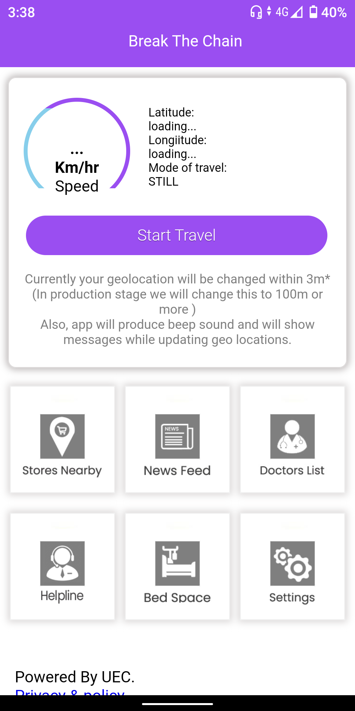
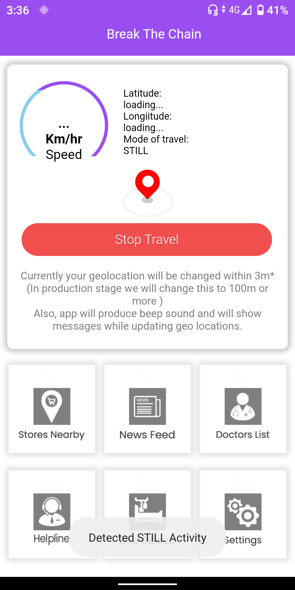
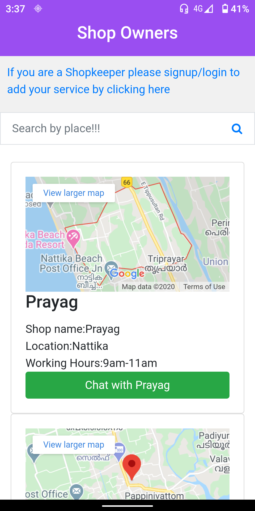
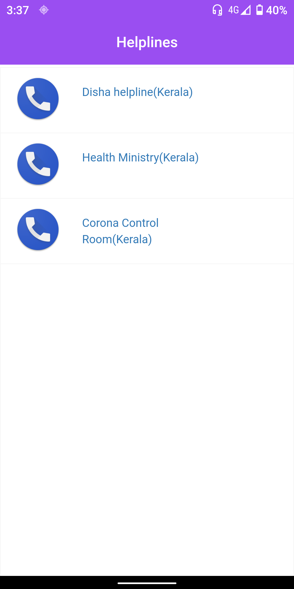
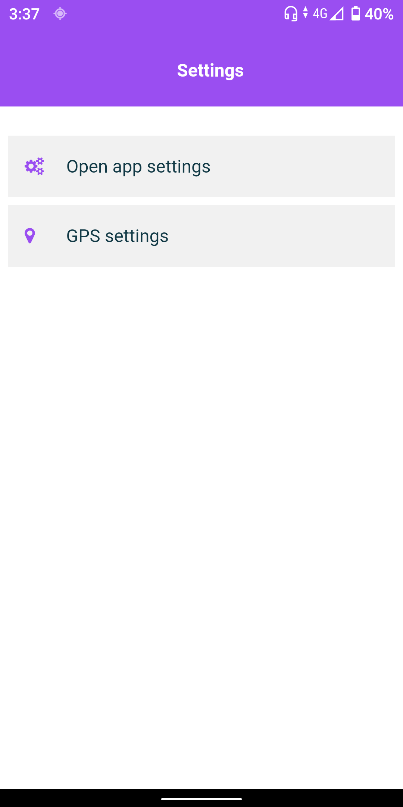

# BreakCoronaApp
> A tracking..... application built with PhoneGap

For more deatailes about the app please visit the
[Our website](http://zateart.com/breakcorona/).
## Screenshots

## Usage
### PhoneGap Build

>Adobe PhoneGap is a standards-based, open-source development framework for building cross-platform mobile apps with HTML, CSS and >JavaScript for iOS and Android™.

#### 1. Create Adobe PhonegapBuild account https://build.phonegap.com/

#### 2. Create a new app with the following repository:

    https://github.com/teamuec/breakcoronaApp.git
